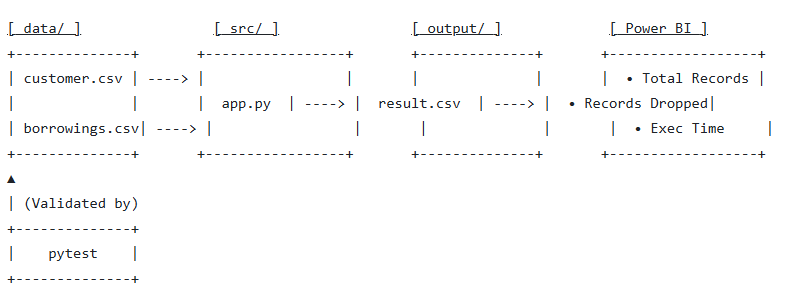

# Library Data Quality Automation (Project 20260601-DE5M5)


## 📖 Scenario
A library wants to automate its manual data quality process using Python and Azure DevOps. This project ingests, cleans, and transforms library borrowing records, making them ready for seamless presentation and analysis in Power BI.

---

## 👥 User Stories
* **As a Data Analyst,** I want automated data cleaning so that I don't have to spend hours manually fixing CSV files every week.
* **As a Library Manager,** I want a Power BI dashboard showing key operational metrics so that I can make data-driven decisions about our book inventory.
* **As a DevOps Engineer,** I want this entire pipeline automated with CI/CD so that every data update is validated and processed without manual intervention.

---

## 📊 Datasets
The project processes two core source CSV files located in the `data/` directory:

* `03_Library SystemCustomers.csv` — Library member records containing unique IDs and names.
* `03_Library Systembook.csv` — Book checkout and return transactions.

### Known Data Issues Handled:
* Missing or empty values
* Duplicate records
* Invalid or inconsistent date formats
* Referential integrity issues (Customer IDs that don't match between files)

---

## 🛠️ Solutions Diagram & Process Flow


### Planned Approach:
1. **Plan:** Set up Azure DevOps Kanban board and document core architecture.
2. **Ingest & Clean:** Run `app.py` to ingest the raw CSVs, apply cleaning logic, and flag data issues.
3. **Test:** Execute unit tests via `pytest` to validate cleaning logic.
4. **Automate:** Trigger Azure DevOps CI/CD pipeline to run the process end-to-end.
5. **Report:** Load the final output files into Power BI to visualize data health and metrics.

---

## 📁 Repository Structure

```text
library-data-quality/
├── data/                        # Source CSV files
│   ├── 03_Library SystemCustomers.csv
│   └── 03_Library Systembook.csv
├── app.py                       # Main execution script for ingestion & cleaning
├── tests/
│   └── test_library.py          # Unit tests validating core cleaning logic
├── output/                      # Target directory for processed data
│   ├── results.csv              # Pipeline summary metrics (used by Power BI KPI cards)
│   └── cleaned_borrowings.csv   # Cleaned transaction detail (used by Power BI charts)
├── pipeline/                    # Azure DevOps pipeline YAML configurations
├── archive/                     # Docker demos, Jupyter Notebooks, training & exercises
└── requirements.txt             # Python dependencies
```

---

## ⚙️ How to Run

### 1. Install dependencies
```bash
pip install -r requirements.txt
```

### 2. Run the pipeline
```bash
python app.py
```

This will produce two output files in the `output/` directory:

| File | Description |
|---|---|
| `results.csv` | Single-row summary of pipeline metrics — powers KPI cards in Power BI |
| `cleaned_borrowings.csv` | Fully cleaned transaction rows with customer names merged in — powers all charts and slicers in Power BI |

### 3. Run the tests
```bash
pytest tests/ -v
```

All three tests should pass:

| Test | What it validates |
|---|---|
| `test_customer_deduplication` | Duplicate customer rows are correctly dropped |
| `test_drop_missing_critical_data` | Rows with missing IDs or book titles are removed |
| `test_date_conversion` | Valid dates parse to `Timestamp`; invalid dates coerce to `NaT` |

---

## 📈 Metrics Captured

`results.csv` contains the following fields after each pipeline run:

| Metric | Description |
|---|---|
| `Execution_Timestamp` | Date and time the pipeline ran |
| `Number_of_records_processed` | Total raw records across both source files |
| `Number_of_records_dropped` | Records removed during cleaning |
| `Unique_Books_Count` | Distinct book titles in the cleaned transactions |
| `Unique_Customers_Count` | Distinct customers in the cleaned customer file |
| `Missing_Checkout_Dates_Count` | Transactions with unparseable or missing checkout dates |
| `Unreturned_Books_Count` | Transactions with no return date (potentially overdue) |
| `Referential_Integrity_Drops` | Transactions dropped because the Customer ID had no match |
| `Pipeline_Execution_Time_Sec` | Total pipeline runtime in seconds |

---

## 🔄 CI/CD Pipeline

This project uses **GitHub Actions** for continuous integration. Every push to `main` and every pull request automatically triggers the pipeline, which installs dependencies and runs the full `pytest` test suite. A green badge at the top of this file confirms the cleaning logic is valid.

### Workflow file
The pipeline is defined in `.github/workflows/ci.yml` and runs on `ubuntu-latest`.

```
Push to main / Pull Request
        │
        ▼
┌─────────────────────────┐
│  Checkout repository    │
└────────────┬────────────┘
             │
             ▼
┌─────────────────────────┐
│  Set up Python 3.11     │
└────────────┬────────────┘
             │
             ▼
┌─────────────────────────┐
│  pip install -r         │
│  requirements.txt       │
└────────────┬────────────┘
             │
             ▼
┌─────────────────────────┐
│  pytest tests/ -v       │
│                         │
│  ✅ Pass → green badge  │
│  ❌ Fail → blocks merge │
└─────────────────────────┘
```

### Activating the badge
Once you've pushed `.github/workflows/ci.yml` to your repo and the workflow has run once, replace the badge URL at the top of this file:
```
https://github.com/YOUR-USERNAME/YOUR-REPO-NAME/actions/workflows/ci.yml/badge.svg
```

---

## 📊 Power BI Report


> *Replace the placeholder above with your screenshot once the report is built.*

---

## 🧪 Testing

Tests are located in `tests/test_library.py` and use [pytest](https://docs.pytest.org/).

Each test uses a small in-memory `DataFrame` to isolate and validate a single piece of cleaning logic, with no dependency on the source CSV files. This keeps tests fast and deterministic.

```bash
# Run all tests
pytest tests/ -v

# Run a single test
pytest tests/test_library.py::test_date_conversion -v
```
